# ⚽ 축구 구단주 게임 (Soccer Tycoon)

축구 구단의 구단주가 되어 **영입·육성 · 구단 경영 · 전술·경기 운영 · 장기 성장**을
모두 다루는 하드코어 시뮬레이션 게임. PC 데스크톱, 싱글플레이, 한국어.

시드만 같으면 완전히 재현되는 헤드리스 엔진 위에 React 데스크톱 UI가 올라가 있고,
Electron 셸에서 SQLite로 저장된다. 난이도를 고르고 구단을 맡아 이적·전술·스태프로
스쿼드를 꾸리고, 경기를 관전하며 하프타임에 개입하고, 리그·컵을 여러 시즌 치른다.

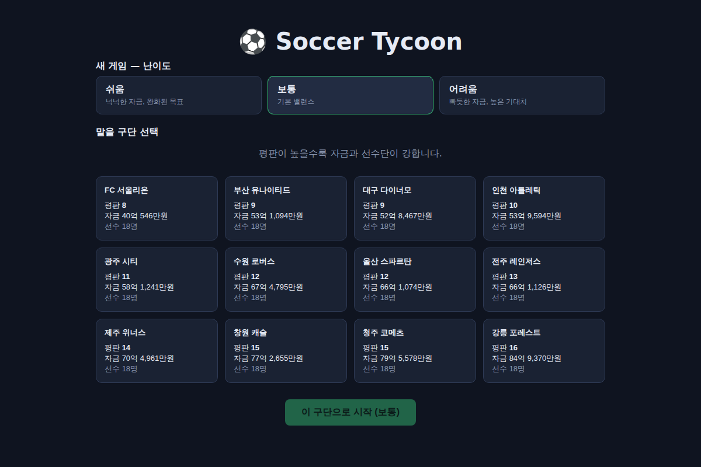

## 주요 기능

| 영역 | 내용 |
|---|---|
| **경기 엔진** | 36개 세부 능력치 → 파생 전력 → 틱(분) 단위 시뮬. 시드 고정 시 완전 재현 |
| **경기 관전** | 내 경기 **2D 피치 실시간 중계**(양 팀 11명 포메이션 배치 + 분 단위 공·이벤트) + **실시간 통계**(점유율·슈팅·유효슈팅) + **부상 실시간 알림·긴급 교체** + **하프타임 전술 개입** |
| **경기 프리뷰** | 관전 전 스카우팅: 양 팀 리그 순위·최근 5경기 폼·전력 7지표 비교·핵심 선수 |
| **전술** | 포메이션 4종, 베스트 XI 자동/슬롯 교체, 지시 슬라이더, 실시간 팀 전력 |
| **다중 리그·승강제** | 1·2부(각 12팀) + 시즌 말 승격/강등(상하위 3팀). 부별 목표(승격/잔류) |
| **리그 + 컵** | 더블 라운드로빈 리그 + 병행 단판 녹아웃 컵(24팀, 승부차기·부전승·상금). 내 컵 경기도 2D 관전 |
| **이적 협상** | 영입=제안에 상대가 수락/역제안/거절(호가=시장가×중요도×계약), 판매=관심 구단 입찰 중 선택. 방출 + AI 이적 시장 |
| **경영** | 선수 가치·연봉, 시즌 재정 정산(중계·입장·스폰서·상금 − 인건비·스태프) |
| **성장·노화** | 잠재력 기반 성장, 노장 하락, 멀티시즌 프랜차이즈 |
| **피로·부상·사기** | 선발 피로/벤치 회복, 확률적 부상(경미/중등도/중상 등급·부위명, 의료가 등급·기간 완화), 승패→사기 → 로테이션 압박 |
| **스태프** | 코칭(성장)·의료(부상)·스카우팅(매물 정보)·유스(유망주 배출) 업그레이드 |
| **유스 아카데미** | 매 시즌 유망주 배출, 스쿼드 상한 정리 |
| **통계·어워드** | 리그 득점 순위, 선수 시즌 기록, 득점왕·시즌 베스트 |
| **경기 상세 통계** | 점유율·슈팅·선수 평점(득점자 표시). 관전 풀타임·라운드 결과 클릭 |
| **선수 상세** | 선수 클릭 → 36개 세부 능력치·파생 전력·계약·상태·사기·재계약·특성·통산 기록·최근 폼·스카우팅 리포트 |
| **스카우팅 리포트** | 선수를 등급(전체·잠재력)·나이 프로필·강점/약점 3종으로 서술형 평가(선수 상세) |
| **통산 기록** | 시즌 득점(리그+컵)을 선수에 누적, 시즌 경계에서 통산 출전·득점으로 이월. 선수 상세 표시 |
| **성장 곡선** | 선수별 시즌 CA 스냅샷 → 선수 상세에 성장/노화 추이 스파크라인 |
| **선수 특성** | 고유 특성 8종(리더·유리몸·철강왕·특급유망주·골잡이·플레이메이커·다혈질·수비바위)이 경기·성장·부상·사기에 반영 |
| **국가대표 차출** | 시즌 사이 국적별 최상위 선수 A매치 차출 → 캡 누적·사기↑, 국제 피로로 다음 시즌 낮은 컨디션·부상 리스크 |
| **사기·재계약** | 출전 시간 기반 사기(핵심 선수 벤치 시 불만), 계약 만료 선수 재계약 |
| **훈련** | 선수별 훈련 포커스(6종)로 시즌 성장 방향 조절 (선수 상세에서 지정) |
| **히스토리** | 명예의 전당(우승·최고순위)·역대 시즌·구단별 우승 순위·현역 통산 득점 순위·우승 시즌 스쿼드 스냅샷·은퇴 선수 레전드 아카이브 |
| **은퇴식** | 내 구단 선수가 은퇴한 시즌, 대시보드에 통산 기록과 함께 헌정 배너로 표시 |
| **이사회 신뢰도** | 시즌 성적(목표 대비)·승강·재정으로 신뢰도 변동, 바닥나면 경질(게임 오버). 대시보드 신뢰도 미터 |
| **이사회 특별 요구** | 시즌마다 검증 가능한 요구(임금 감축·컵 우승·득점왕 배출) 부여, 달성/실패로 신뢰도 가감 |
| **온보딩** | 난이도 3종(자금·목표), 보드진 시즌 목표, 환영 안내 + 도움말 |
| **저장** | Electron=SQLite / 웹=localStorage, 슬롯 기반 자동 저장·이어하기 |

## 스크린샷

| | |
|---|---|
| 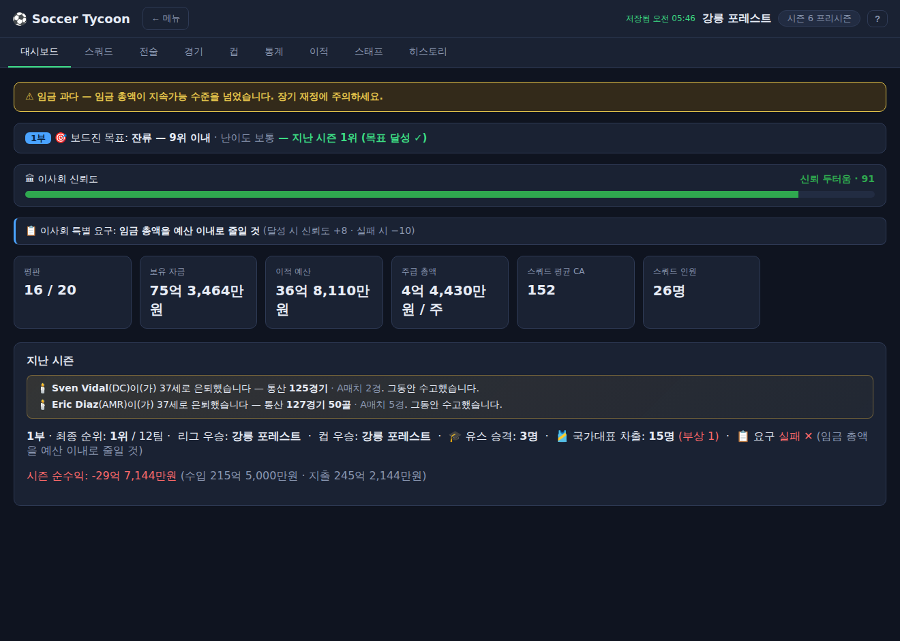 대시보드·목표 | 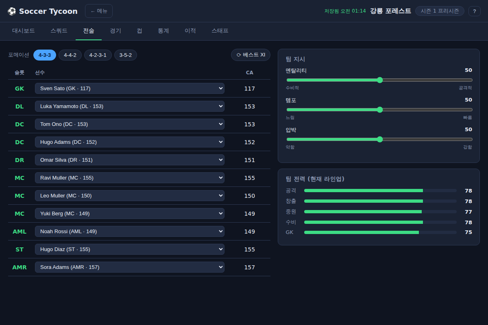 전술 편집 |
| 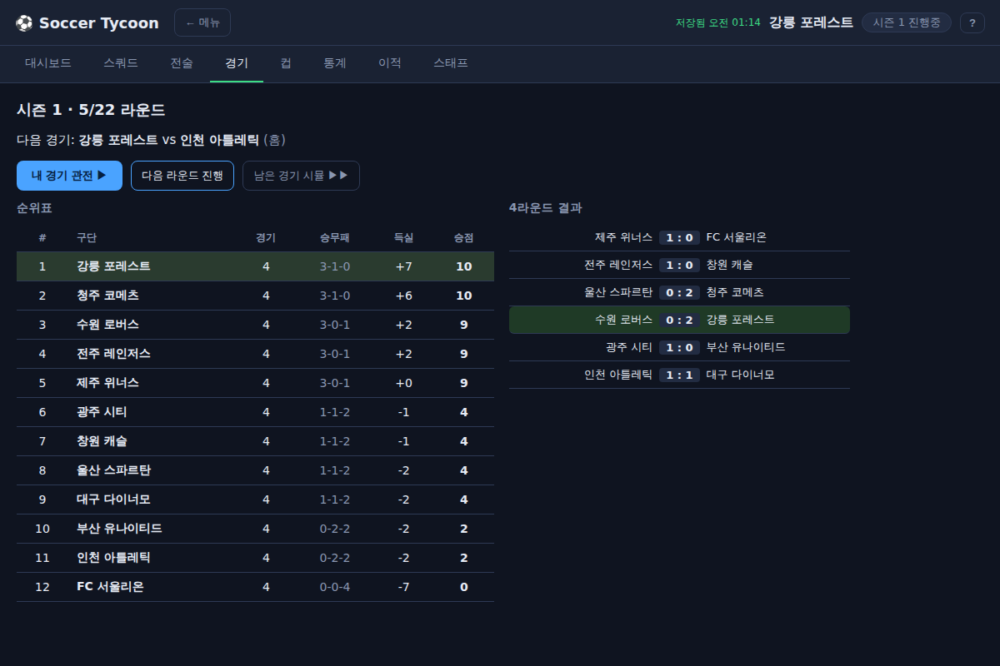 경기·라이브 순위 | 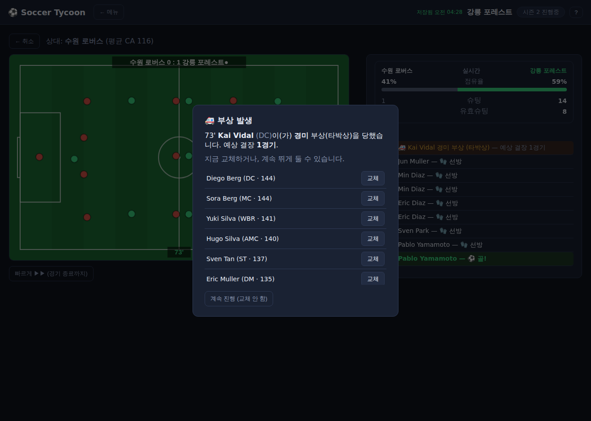 경기 2D 관전 |
| 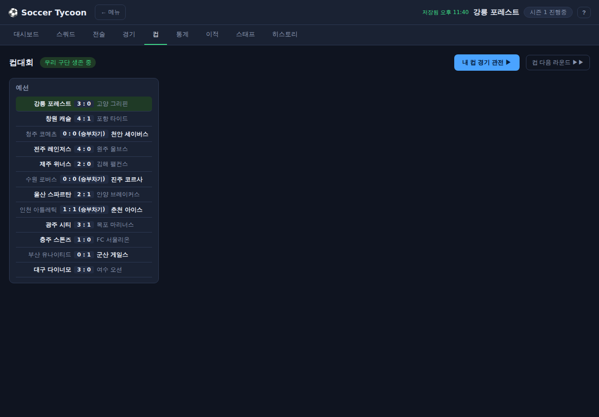 컵 브래킷 | 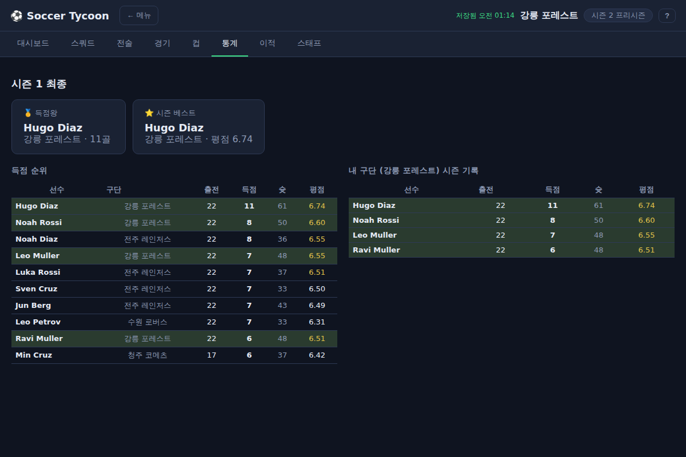 통계·어워드 |
| 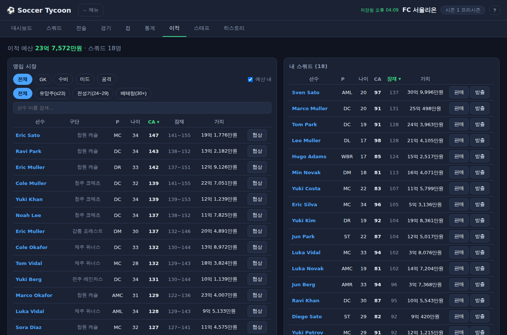 이적 시장 | 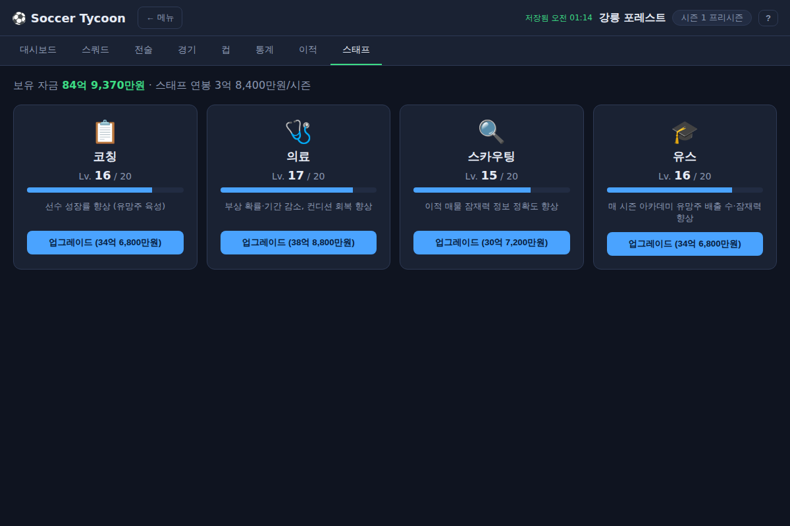 스태프 |
| 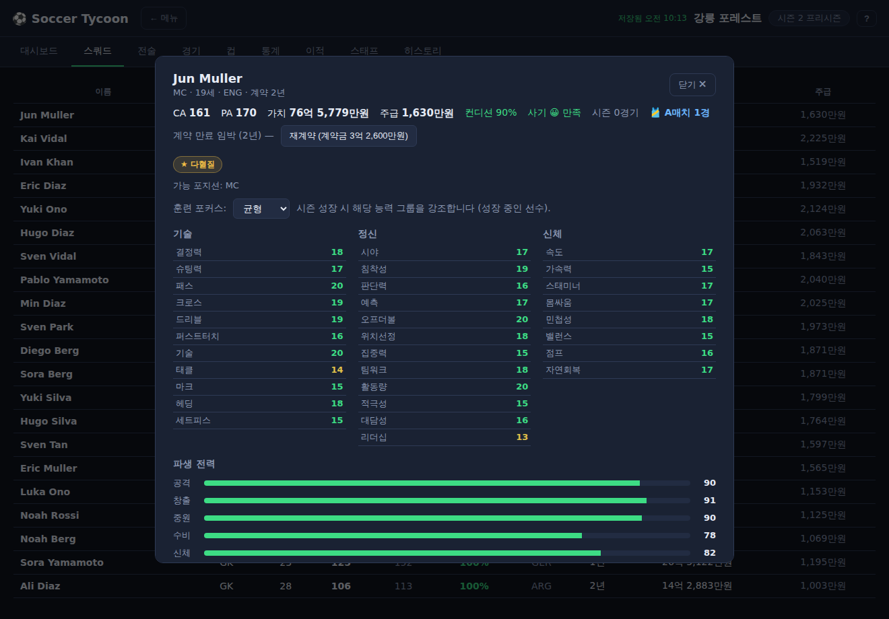 선수 상세(36능력치) | 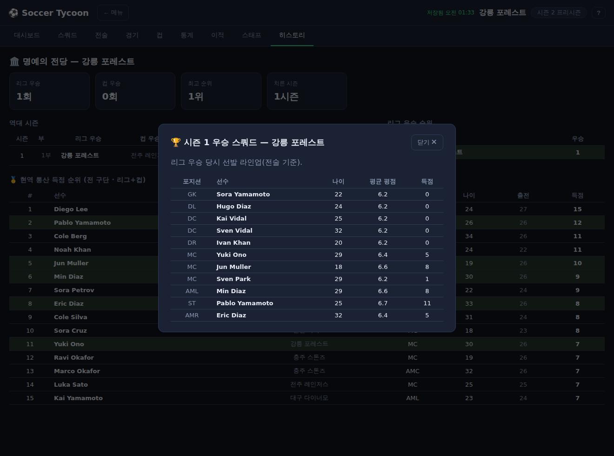 히스토리·명예의 전당 |
| 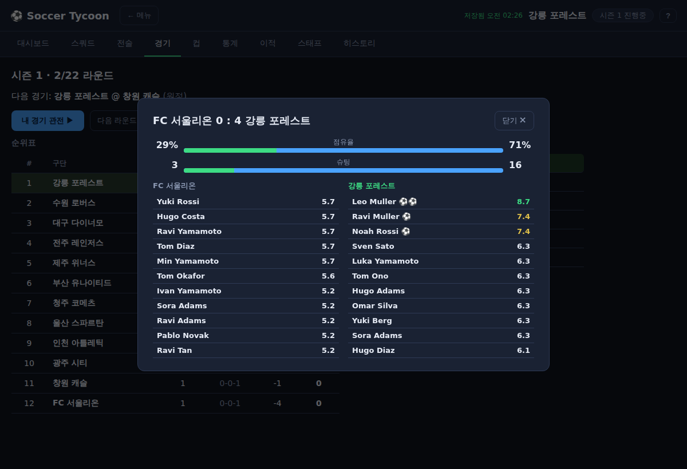 경기 상세 통계 | 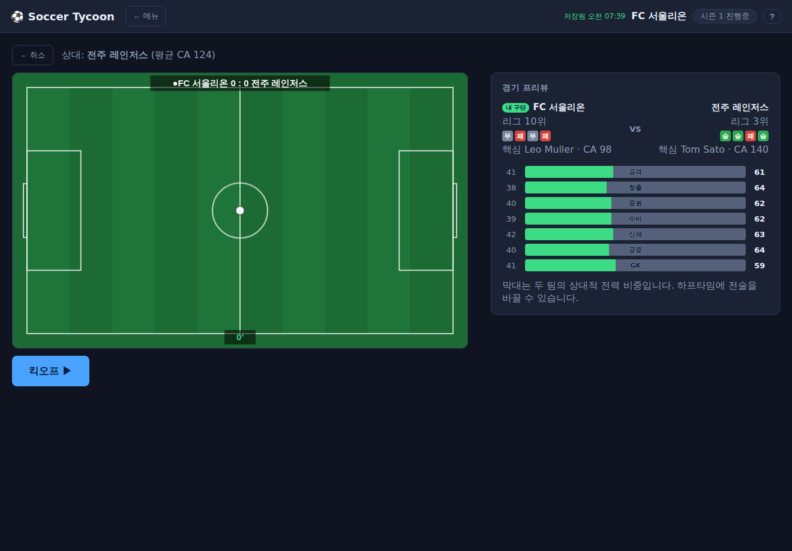 경기 프리뷰(폼·전력) |

## 패키지 (TypeScript 모노레포)

| 패키지 | 역할 | 테스트 |
|---|---|---|
| `@soccer-tycoon/engine` | 헤드리스 시뮬레이션 엔진 (경기·경영·이적·협상·성장·컵·통계·스태프·유스·특성·국대·이사회·요구·통산·부상·스카우팅) | 154 |
| `@soccer-tycoon/app` | Vite + React UI (9개 화면 + 경기 관전) | 8 |
| `@soccer-tycoon/desktop` | Electron 셸 + SQLite 세이브(`node:sqlite`) | 4 |

> 설계 원칙: 엔진은 UI 의존성이 0이라 헤드리스로 실행·검증된다. 같은 시드는 같은 결과.
> 저장은 `SaveStore` 인터페이스로 추상화되어 Electron(SQLite)/웹(localStorage)이 동일 코드로 동작한다.

## 빠른 실행

```bash
npm install

# 데스크톱 UI 개발 서버 (브라우저: localhost:5173)
npm run dev --workspace @soccer-tycoon/app

# Electron 데스크톱 앱 (데스크톱 환경 필요)
npm run build --workspace @soccer-tycoon/app
npm run start --workspace @soccer-tycoon/desktop

# 설치 파일 생성 (AppImage/nsis/dmg — 대상 OS 데스크톱 환경)
npm run dist --workspace @soccer-tycoon/desktop

# 전체 테스트 (engine + app + desktop)
npm test

# 헤드리스 데모 / 밸런스 하니스
npm run demo                                             # 경기 1건 텍스트 중계
npm run sim-season   --workspace @soccer-tycoon/engine   # 단일 시즌 지표
npm run franchise-demo --workspace @soccer-tycoon/engine # 멀티시즌 성장·노화
npm run economy-demo --workspace @soccer-tycoon/engine   # 가치평가·이적·재정
npm run balance      --workspace @soccer-tycoon/engine   # 멀티시즌 밸런스 리포트
```

## 문서

- [기획서 (docs/design.md)](docs/design.md) — 핵심 의사결정, 도메인 모델, 진행 현황.
- [경기 엔진 & 능력치 (docs/engine.md)](docs/engine.md) — 능력치 36종, 팀 강도, 틱 시뮬.
- [경영·이적 (docs/economy.md)](docs/economy.md) — 가치·연봉 공식, 재정, 이적 AI.
- [밸런스 리포트 (docs/balance.md)](docs/balance.md) — 멀티시즌 지표·튜닝 노트·알려진 한계.
- 패키지 상세: [`engine`](packages/engine/README.md) · [`app`](packages/app/README.md) · [`desktop`](packages/desktop/README.md).

## 상태

플레이 가능한 완성 프로토타입. 4기둥 + 경기 관전(프리뷰·2D 포메이션·실시간 통계) +
리그·컵 + 피로/부상/징계 + 통계 + 스태프/유스 + 임금·파산(파이낸셜 페어플레이) +
선수 특성 + 국가대표 차출 + 이적/판매 협상 + 이사회 신뢰도·경질 + 온보딩/난이도까지
구현됐고, 멀티시즌 밸런스가 검증됐다(전력↔순위 상관 0.86, 경기당 득점 2.69, 적자 0/15 시즌).
설치형 패키징(electron-builder)도 구성되어 대상 OS 데스크톱 환경에서 빌드할 수 있다.
